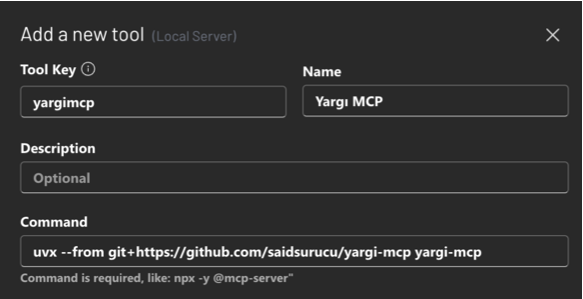

# Yargı MCP: Türk Hukuk Kaynakları için MCP Sunucusu

[](https://www.star-history.com/#saidsurucu/yargi-mcp&Date)

Bu proje, çeşitli Türk hukuk kaynaklarına (Yargıtay, Danıştay, Emsal Kararlar, Uyuşmazlık Mahkemesi, Anayasa Mahkemesi - Norm Denetimi ile Bireysel Başvuru Kararları, Kamu İhale Kurulu Kararları ve Rekabet Kurumu Kararları) erişimi kolaylaştıran bir [FastMCP](https://gofastmcp.com/) sunucusu oluşturur. Bu sayede, bu kaynaklardan veri arama ve belge getirme işlemleri, Model Context Protocol (MCP) destekleyen LLM (Büyük Dil Modeli) uygulamaları (örneğin Claude Desktop veya [5ire](https://5ire.app)) ve diğer istemciler tarafından araç (tool) olarak kullanılabilir hale gelir.


🎯 **Temel Özellikler**

* Çeşitli Türk hukuk veritabanlarına programatik erişim için standart bir MCP arayüzü.
* **Kapsamlı Mahkeme Daire/Kurul Filtreleme:** 79 farklı daire/kurul filtreleme seçeneği
* **Dual/Triple API Desteği:** Her mahkeme için birden fazla API kaynağı ile maksimum kapsama
* **Kapsamlı Tarih Filtreleme:** Tüm Bedesten API araçlarında ISO 8601 formatında tarih aralığı filtreleme
* **Kesin Cümle Arama:** Tüm Bedesten API araçlarında çift tırnak ile tam cümle arama desteği
* Aşağıdaki kurumların kararlarını arama ve getirme yeteneği:
    * **Yargıtay:** Detaylı kriterlerle karar arama ve karar metinlerini Markdown formatında getirme. **Dual API** (Ana + Bedesten) + **52 Daire/Kurul Filtreleme** + **Tarih & Kesin Cümle Arama** (Hukuk/Ceza Daireleri, Genel Kurullar)
    * **Danıştay:** Anahtar kelime bazlı ve detaylı kriterlerle karar arama; karar metinlerini Markdown formatında getirme. **Triple API** (Keyword + Detailed + Bedesten) + **27 Daire/Kurul Filtreleme** + **Tarih & Kesin Cümle Arama** (İdari Daireler, Vergi/İdare Kurulları, Askeri Yüksek İdare Mahkemesi)
    * **Yerel Hukuk Mahkemeleri:** Bedesten API ile yerel hukuk mahkemesi kararlarına erişim + **Tarih & Kesin Cümle Arama**
    * **İstinaf Hukuk Mahkemeleri:** Bedesten API ile istinaf mahkemesi kararlarına erişim + **Tarih & Kesin Cümle Arama**
    * **Kanun Yararına Bozma (KYB):** Bedesten API ile olağanüstü kanun yoluna erişim + **Tarih & Kesin Cümle Arama**
    * **Emsal (UYAP):** Detaylı kriterlerle emsal karar arama ve karar metinlerini Markdown formatında getirme.
    * **Uyuşmazlık Mahkemesi:** Form tabanlı kriterlerle karar arama ve karar metinlerini (URL ile erişilen) Markdown formatında getirme.
    * **Anayasa Mahkemesi (Norm Denetimi):** Kapsamlı kriterlerle norm denetimi kararlarını arama; uzun karar metinlerini (5.000 karakterlik) sayfalanmış Markdown formatında getirme.
    * **Anayasa Mahkemesi (Bireysel Başvuru):** Kapsamlı kriterlerle bireysel başvuru "Karar Arama Raporu" oluşturma ve listedeki kararların metinlerini (5.000 karakterlik) sayfalanmış Markdown formatında getirme.
    * **KİK (Kamu İhale Kurulu):** Çeşitli kriterlerle Kurul kararlarını arama; uzun karar metinlerini (varsayılan 5.000 karakterlik) sayfalanmış Markdown formatında getirme.
    * **Rekabet Kurumu:** Çeşitli kriterlerle Kurul kararlarını arama; karar metinlerini Markdown formatında getirme.

* Karar metinlerinin daha kolay işlenebilmesi için Markdown formatına çevrilmesi.
* Claude Desktop uygulaması ile `fastmcp install` komutu kullanılarak kolay entegrasyon.
* Yargı MCP artık [5ire](https://5ire.app) gibi Claude Desktop haricindeki MCP istemcilerini de destekliyor!
---
🚀 **Claude Haricindeki Modellerle Kullanmak İçin Çok Kolay Kurulum (Örnek: 5ire için)**

Bu bölüm, Yargı MCP aracını 5ire gibi Claude Desktop dışındaki MCP istemcileriyle kullanmak isteyenler içindir.

* **Python Kurulumu:** Sisteminizde Python 3.11 veya üzeri kurulu olmalıdır. Kurulum sırasında "**Add Python to PATH**" (Python'ı PATH'e ekle) seçeneğini işaretlemeyi unutmayın. [Buradan](https://www.python.org/downloads/) indirebilirsiniz.
* **Git Kurulumu (Windows):** Bilgisayarınıza [git](https://git-scm.com/downloads/win) yazılımını indirip kurun. "Git for Windows/x64 Setup" seçeneğini indirmelisiniz.
* **`uv` Kurulumu:**
    * **Windows Kullanıcıları (PowerShell):** Bir CMD ekranı açın ve bu kodu çalıştırın: `powershell -ExecutionPolicy ByPass -c "irm https://astral.sh/uv/install.ps1 | iex"`
    * **Mac/Linux Kullanıcıları (Terminal):** Bir Terminal ekranı açın ve bu kodu çalıştırın: `curl -LsSf https://astral.sh/uv/install.sh | sh`
* **Microsoft Visual C++ Redistributable (Windows):** Bazı Python paketlerinin doğru çalışması için gereklidir. [Buradan](https://learn.microsoft.com/en-us/cpp/windows/latest-supported-vc-redist?view=msvc-170) indirip kurun.
* İşletim sisteminize uygun [5ire](https://5ire.app) MCP istemcisini indirip kurun.
* 5ire'ı açın. **Workspace -> Providers** menüsünden kullanmak istediğiniz LLM servisinin API anahtarını girin.
* **Tools** menüsüne girin. **+Local** veya **New** yazan butona basın.
    * **Tool Key:** `yargimcp`
    * **Name:** `Yargı MCP`
    * **Command:**
        ```
        uvx --from git+https://github.com/saidsurucu/yargi-mcp yargi-mcp
        ```
    * **Save** butonuna basarak kaydedin.

* Şimdi **Tools** altında **Yargı MCP**'yi görüyor olmalısınız. Üstüne geldiğinizde sağda çıkan butona tıklayıp etkinleştirin (yeşil ışık yanmalı).
* Artık Yargı MCP ile konuşabilirsiniz.

---
⚙️ **Claude Desktop Manuel Kurulumu**


1.  **Ön Gereksinimler:** Python, `uv`, (Windows için) Microsoft Visual C++ Redistributable'ın sisteminizde kurulu olduğundan emin olun. Detaylı bilgi için yukarıdaki "5ire için Kurulum" bölümündeki ilgili adımlara bakabilirsiniz.
2.  Claude Desktop **Settings -> Developer -> Edit Config**.
3.  Açılan `claude_desktop_config.json` dosyasına `mcpServers` altına ekleyin:

    ```json
    {
      "mcpServers": {
        // ... (varsa diğer sunucularınız) ...
        "Yargı MCP": {
          "command": "uvx",
          "args": [
            "--from", "git+https://github.com/saidsurucu/yargi-mcp",
            "yargi-mcp"
          ]
        }
      }
    }
    ```
4.  Claude Desktop'ı kapatıp yeniden başlatın.

🛠️ **Kullanılabilir Araçlar (MCP Tools)**

Bu FastMCP sunucusu aşağıdaki temel araçları sunar:

### **Yargıtay Araçları (Dual API + 52 Daire Filtreleme)**
* **Ana API:**
    * `search_yargitay_detailed(arananKelime, birimYrgKurulDaire, ...)`: Yargıtay kararlarını detaylı kriterlerle arar. **52 daire/kurul seçeneği** (Hukuk/Ceza Daireleri 1-23, Genel Kurullar, Başkanlar Kurulu)
    * `get_yargitay_document_markdown(id: str)`: Belirli bir Yargıtay kararının metnini Markdown formatında getirir.
* **Bedesten API (Alternatif):**
    * `search_yargitay_bedesten(phrase, birimAdi, kararTarihiStart, kararTarihiEnd, ...)`: Bedesten API ile Yargıtay kararlarını arar. **Aynı 52 daire filtreleme** + **Tarih Filtreleme** + **Kesin Cümle Arama** (`"\"mülkiyet kararı\""`)
    * `get_yargitay_bedesten_document_markdown(documentId: str)`: Bedesten'den karar metni (HTML/PDF → Markdown)

### **Danıştay Araçları (Triple API + 27 Daire Filtreleme)**
* **Ana API'lar:**
    * `search_danistay_by_keyword(andKelimeler, orKelimeler, ...)`: Danıştay kararlarını anahtar kelimelerle arar.
    * `search_danistay_detailed(daire, esasYil, ...)`: Danıştay kararlarını detaylı kriterlerle arar.
    * `get_danistay_document_markdown(id: str)`: Belirli bir Danıştay kararının metnini Markdown formatında getirir.
* **Bedesten API (Alternatif):**
    * `search_danistay_bedesten(phrase, birimAdi, kararTarihiStart, kararTarihiEnd, ...)`: Bedesten API ile Danıştay kararlarını arar. **27 daire/kurul seçeneği** + **Tarih Filtreleme** + **Kesin Cümle Arama** (`"\"idari işlem\""`) (1-17. Daireler, Vergi/İdare Kurulları, Askeri Mahkemeler)
    * `get_danistay_bedesten_document_markdown(documentId: str)`: Bedesten'den karar metni

### **Diğer Mahkemeler (Bedesten API + Gelişmiş Arama)**
* **Yerel Hukuk Mahkemeleri:**
    * `search_yerel_hukuk_bedesten(phrase, kararTarihiStart, kararTarihiEnd, ...)`: Yerel hukuk mahkemesi kararlarını arar + **Tarih & Kesin Cümle Arama** (`"\"sözleşme ihlali\""`)
    * `get_yerel_hukuk_bedesten_document_markdown(documentId: str)`: Karar metni
* **İstinaf Hukuk Mahkemeleri:**
    * `search_istinaf_hukuk_bedesten(phrase, kararTarihiStart, kararTarihiEnd, ...)`: İstinaf mahkemesi kararlarını arar + **Tarih & Kesin Cümle Arama** (`"\"temyiz incelemesi\""`)
    * `get_istinaf_hukuk_bedesten_document_markdown(documentId: str)`: Karar metni
* **Kanun Yararına Bozma (KYB):**
    * `search_kyb_bedesten(phrase, kararTarihiStart, kararTarihiEnd, ...)`: Olağanüstü kanun yolu kararlarını arar + **Tarih & Kesin Cümle Arama** (`"\"kanun yararına bozma\""`)
    * `get_kyb_bedesten_document_markdown(documentId: str)`: Karar metni

* **Emsal Karar Araçları:**
    * `search_emsal_detailed_decisions(search_query: EmsalSearchRequest) -> CompactEmsalSearchResult`: Emsal (UYAP) kararlarını detaylı kriterlerle arar.
    * `get_emsal_document_markdown(id: str) -> EmsalDocumentMarkdown`: Belirli bir Emsal kararının metnini Markdown formatında getirir.

* **Uyuşmazlık Mahkemesi Araçları:**
    * `search_uyusmazlik_decisions(search_params: UyusmazlikSearchRequest) -> UyusmazlikSearchResponse`: Uyuşmazlık Mahkemesi kararlarını çeşitli form kriterleriyle arar.
    * `get_uyusmazlik_document_markdown_from_url(document_url: HttpUrl) -> UyusmazlikDocumentMarkdown`: Bir Uyuşmazlık kararını tam URL'sinden alıp Markdown formatında getirir.

* **Anayasa Mahkemesi (Norm Denetimi) Araçları:**
    * `search_anayasa_norm_denetimi_decisions(search_query: AnayasaNormDenetimiSearchRequest) -> AnayasaSearchResult`: AYM Norm Denetimi kararlarını kapsamlı kriterlerle arar.
    * `get_anayasa_norm_denetimi_document_markdown(document_url: str, page_number: Optional[int] = 1) -> AnayasaDocumentMarkdown`: Belirli bir AYM Norm Denetimi kararını URL'sinden alır ve 5.000 karakterlik sayfalanmış Markdown içeriğini getirir.

* **Anayasa Mahkemesi (Bireysel Başvuru) Araçları:**
    * `search_anayasa_bireysel_basvuru_report(search_query: AnayasaBireyselReportSearchRequest) -> AnayasaBireyselReportSearchResult`: AYM Bireysel Başvuru "Karar Arama Raporu" oluşturur.
    * `get_anayasa_bireysel_basvuru_document_markdown(document_url_path: str, page_number: Optional[int] = 1) -> AnayasaBireyselBasvuruDocumentMarkdown`: Belirli bir AYM Bireysel Başvuru kararını URL path'inden alır ve 5.000 karakterlik sayfalanmış Markdown içeriğini getirir.

* **KİK (Kamu İhale Kurulu) Araçları:**
    * `search_kik_decisions(search_query: KikSearchRequest) -> KikSearchResult`: KİK (Kamu İhale Kurulu) kararlarını arar. 
    * `get_kik_document_markdown(karar_id: str, page_number: Optional[int] = 1) -> KikDocumentMarkdown`: Belirli bir KİK kararını, Base64 ile encode edilmiş `karar_id`'sini kullanarak alır ve 5.000 karakterlik sayfalanmış Markdown içeriğini getirir.
* **Rekabet Kurumu Araçları:**
    * `search_rekabet_kurumu_decisions(KararTuru: Literal[...], ...) -> RekabetSearchResult`: Rekabet Kurumu kararlarını arar. `KararTuru` için kullanıcı dostu isimler kullanılır (örn: "Birleşme ve Devralma").
    * `get_rekabet_kurumu_document(karar_id: str, page_number: Optional[int] = 1) -> RekabetDocument`: Belirli bir Rekabet Kurumu kararını `karar_id` ile alır. Kararın PDF formatındaki orijinalinden istenen sayfayı ayıklar ve Markdown formatında döndürür.


---

### **📊 Kapsamlı İstatistikler**
- **Toplam Mahkeme/Kurum:** 11 farklı hukuki kurum
- **Toplam MCP Tool:** 30+ arama ve belge getirme aracı  
- **Daire/Kurul Filtreleme:** 79 farklı seçenek (52 Yargıtay + 27 Danıştay)
- **Tarih Filtreleme:** 5 Bedesten API aracında ISO 8601 formatında tam tarih aralığı desteği
- **Kesin Cümle Arama:** 5 Bedesten API aracında çift tırnak ile tam cümle arama (`"\"mülkiyet kararı\""` formatı)
- **API Kaynağı:** Dual/Triple API desteği ile maksimum kapsama
- **Tam Türk Adalet Sistemi:** Yerel mahkemelerden en yüksek mahkemelere kadar

**🏛️ Desteklenen Mahkeme Hiyerarşisi:**
```
Yerel Mahkemeler → İstinaf → Yargıtay/Danıştay → Anayasa Mahkemesi
     ↓              ↓            ↓                    ↓
Bedesten API   Bedesten API   Dual/Triple API   Norm+Bireysel API
+ Tarih + Kesin + Tarih + Kesin + Daire + Tarih   + Gelişmiş
  Cümle Arama    Cümle Arama   + Kesin Cümle     Arama
```

**⚖️ Kapsamlı Filtreleme Özellikleri:**
- **Daire Filtreleme:** 79 seçenek (52 Yargıtay + 27 Danıştay)
  - **Yargıtay:** 52 seçenek (1-23 Hukuk, 1-23 Ceza, Genel Kurullar, Başkanlar Kurulu)
  - **Danıştay:** 27 seçenek (1-17 Daireler, İdare/Vergi Kurulları, Askeri Mahkemeler)
- **Tarih Filtreleme:** 5 Bedesten API aracında ISO 8601 formatı (YYYY-MM-DDTHH:MM:SS.000Z)
  - Tek tarih, tarih aralığı, tek taraflı filtreleme desteği
  - Yargıtay, Danıştay, Yerel Hukuk, İstinaf Hukuk, KYB kararları
- **Kesin Cümle Arama:** 5 Bedesten API aracında çift tırnak formatı
  - Normal arama: `"mülkiyet kararı"` (kelimeler ayrı ayrı)
  - Kesin arama: `"\"mülkiyet kararı\""` (tam cümle olarak)
  - Daha kesin sonuçlar için hukuki terimler ve kavramlar

📜 **Lisans**

Bu proje MIT Lisansı altında lisanslanmıştır. Detaylar için `LICENSE` dosyasına bakınız.
