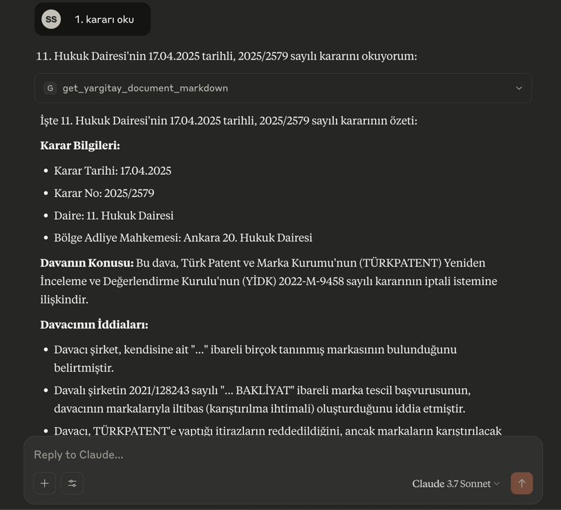

# Yargı MCP: Türk Hukuk Kaynakları için MCP Sunucusu

Bu proje, çeşitli Türk hukuk kaynaklarına (Yargıtay, Danıştay, Emsal Kararlar, Uyuşmazlık Mahkemesi ve Anayasa Mahkemesi - Norm Denetimi ile Bireysel Başvuru Kararları) erişimi kolaylaştıran bir [FastMCP](https://gofastmcp.com/) sunucusu oluşturur. Bu sayede, bu kaynaklardan veri arama ve belge getirme işlemleri, Model Context Protocol (MCP) destekleyen LLM (Büyük Dil Modeli) uygulamaları (örneğin Claude Desktop) ve diğer istemciler tarafından araç (tool) olarak kullanılabilir hale gelir.



🎯 **Temel Özellikler**

* Çeşitli Türk hukuk veritabanlarına programatik erişim için standart bir MCP arayüzü.
* Aşağıdaki kurumların kararlarını arama ve getirme yeteneği:
    * **Yargıtay:** Detaylı kriterlerle karar arama ve karar metinlerini Markdown formatında getirme.
    * **Danıştay:** Anahtar kelime bazlı ve detaylı kriterlerle karar arama; karar metinlerini Markdown formatında getirme.
    * **Emsal (UYAP):** Detaylı kriterlerle emsal karar arama ve karar metinlerini Markdown formatında getirme.
    * **Uyuşmazlık Mahkemesi:** Form tabanlı kriterlerle karar arama ve karar metinlerini (URL ile erişilen) Markdown formatında getirme.
    * **Anayasa Mahkemesi (Norm Denetimi):** Kapsamlı kriterlerle norm denetimi kararlarını arama; uzun karar metinlerini (5.000 karakterlik) sayfalanmış Markdown formatında getirme.
    * **Anayasa Mahkemesi (Bireysel Başvuru):** Kapsamlı kriterlerle bireysel başvuru "Karar Arama Raporu" oluşturma ve listedeki kararların metinlerini (5.000 karakterlik) sayfalanmış Markdown formatında getirme.
* Karar metinlerinin daha kolay işlenebilmesi için Markdown formatına çevrilmesi.
* Claude Desktop uygulaması ile `fastmcp install` komutu kullanılarak kolay entegrasyon.

📋 **Ön Gereksinimler**

* **Python Sürümü:** Python 3.10 veya daha yeni bir sürümünün sisteminizde kurulu olması gerekmektedir. Python'ı [python.org](https://www.python.org/) adresinden indirebilirsiniz.
* **Paket Yöneticisi:** `pip` (Python ile birlikte gelir) veya tercihen `uv` ([Astral](https://astral.sh/uv) tarafından geliştirilen hızlı Python paket yöneticisi).

⚙️ **Kurulum Adımları (Claude Desktop Entegrasyonu Odaklı)**

Claude Desktop uygulamasına yükleme yapabilmek için öncelikle `uv` (önerilir) ve `fastmcp` komut satırı araçlarını kurmanız, ardından proje dosyalarını almanız gerekmektedir.

**1. `uv` Kurulumu (Önerilir)**

* **macOS ve Linux için:**
    ```bash
    curl -LsSf [https://astral.sh/uv/install.sh](https://astral.sh/uv/install.sh) | sh
    ```
* **Windows için (PowerShell kullanarak):**
    ```powershell
    powershell -c "irm [https://astral.sh/uv/install.ps1](https://astral.sh/uv/install.ps1) | iex"
    ```
* Kurulumdan sonra, `uv` komutunun sisteminiz tarafından tanınması için terminalinizi yeniden başlatmanız veya `PATH` ortam değişkeninizi güncellemeniz gerekebilir. `uv --version` komutu ile kurulumu doğrulayabilirsiniz.

**2. `fastmcp` Komut Satırı Aracının (CLI) Kurulumu**

* **`uv` kullanarak (önerilir):**
    ```bash
    uv pip install fastmcp
    ```
* **`pip` kullanarak (alternatif):**
    ```bash
    pip install fastmcp
    ```
    `fastmcp --version` komutu ile kurulumu doğrulayabilirsiniz.

**3. Proje Dosyalarını Alın**

Bu Yargı MCP sunucusunun kaynak kodlarını bilgisayarınıza indirin (URL'yi kendi reponuzla değiştirin):
```bash
git clone [https://github.com/KULLANICIADINIZ/yargi-mcp.git](https://github.com/KULLANICIADINIZ/yargi-mcp.git)
cd yargi-mcp
```
Bu README.md dosyasının ve `mcp_server_main.py` script'inin bulunduğu dizine `cd` komutu ile geçmiş olacaksınız.

**4. Sunucuya Özel Bağımlılıkların Bilinmesi**

Bu sunucunun (`mcp_server_main.py`) çalışması için aşağıdaki Python kütüphanelerine ihtiyacı vardır. Bu kütüphaneler `fastmcp install` sırasında `--with` parametreleriyle belirtilecektir:

```text
# requirements.txt
fastmcp
httpx
beautifulsoup4
markitdown
pydantic
aiohttp
```
(Eğer sunucuyu bağımsız olarak geliştirmek veya test etmek isterseniz, projenizin kök dizininde bir sanal ortam oluşturup – örn: `uv venv` & `source .venv/bin/activate` – bu bağımlılıkları `uv pip install -r requirements.txt` komutuyla kurabilirsiniz.)

🚀 **Claude Desktop Entegrasyonu (`fastmcp install` ile - Önerilen)**

Yukarıdaki kurulum adımlarını tamamladıktan sonra, bu sunucuyu Claude Desktop uygulamasına kalıcı bir araç olarak eklemenin en kolay yolu `fastmcp install` komutunu kullanmaktır:

1.  Terminalde `mcp_server_main.py` dosyasının bulunduğu `yargi-mcp` dizininde olduğunuzdan emin olun.
2.  Aşağıdaki komutu çalıştırın:

    ```bash
    fastmcp install mcp_server_main.py \
        --name "Yargı MCP" \
        --with httpx \
        --with beautifulsoup4 \
        --with markitdown \
        --with pydantic \
        --with aiohttp
    ```

    * `--name "Yargı MCP"`: Araç Claude Desktop'ta bu isimle görünecektir.
    * `--with ...`: Sunucunun çalışması için gereken Python bağımlılıklarını belirtir.

    Bu komut, `uv` kullanarak sunucunuz için izole bir Python ortamı oluşturacak, belirtilen bağımlılıkları kuracak ve aracı Claude Desktop uygulamasına kaydedecektir.

⚙️ **Claude Desktop Manuel Kurulumu (Yapılandırma Dosyası ile - Alternatif)**

1.  **Claude Desktop Ayarları**'nı açın.
2.  **Developer** sekmesine gidin ve **Edit Config** düğmesine tıklayın.
3.  Açılan `claude_desktop_config.json` dosyasını bir metin düzenleyici ile açın.
4.  `mcpServers` nesnesine aşağıdaki JSON bloğunu ekleyin:

    ```json
    {
      "mcpServers": {
        // ... (varsa diğer sunucu tanımlamalarınız) ...

        "Yargı MCP": {
          "command": "uv",
          "args": [
            "run",
            "--with", "httpx",
            "--with", "beautifulsoup4",
            "--with", "markitdown",
            "--with", "pydantic",
            "--with", "aiohttp",
            "--with", "fastmcp",
            "fastmcp", "run", 
            "/TAM/PROJE/YOLUNUZ/yargi-mcp/mcp_server_main.py" 
          ]
        }
      }
    }
    ```
    * **Önemli:** `/TAM/PROJE/YOLUNUZ/yargi-mcp/mcp_server_main.py` kısmını, `mcp_server_main.py` dosyasının sisteminizdeki **tam ve doğru yolu** ile değiştirmeyi unutmayın.
5.  Claude Desktop'ı yeniden başlatın.

🛠️ **Kullanılabilir Araçlar (MCP Tools)**

Bu FastMCP sunucusu aşağıdaki temel araçları sunar:

* **Yargıtay Araçları:**
    * `search_yargitay_detailed(search_query: YargitayDetailedSearchRequest) -> CompactYargitaySearchResult`: Yargıtay kararlarını detaylı kriterlerle arar.
    * `get_yargitay_document_markdown(document_id: str) -> YargitayDocumentMarkdown`: Belirli bir Yargıtay kararının metnini Markdown formatında getirir.

* **Danıştay Araçları:**
    * `search_danistay_by_keyword(search_query: DanistayKeywordSearchRequest) -> CompactDanistaySearchResult`: Danıştay kararlarını anahtar kelimelerle arar.
    * `search_danistay_detailed(search_query: DanistayDetailedSearchRequest) -> CompactDanistaySearchResult`: Danıştay kararlarını detaylı kriterlerle arar.
    * `get_danistay_document_markdown(document_id: str) -> DanistayDocumentMarkdown`: Belirli bir Danıştay kararının metnini Markdown formatında getirir.

* **Emsal Karar Araçları:**
    * `search_emsal_detailed_decisions(search_query: EmsalSearchRequest) -> CompactEmsalSearchResult`: Emsal (UYAP) kararlarını detaylı kriterlerle arar.
    * `get_emsal_document_markdown(document_id: str) -> EmsalDocumentMarkdown`: Belirli bir Emsal kararının metnini Markdown formatında getirir.

* **Uyuşmazlık Mahkemesi Araçları:**
    * `search_uyusmazlik_decisions(search_params: UyusmazlikSearchRequest) -> UyusmazlikSearchResponse`: Uyuşmazlık Mahkemesi kararlarını çeşitli form kriterleriyle arar.
    * `get_uyusmazlik_document_markdown_from_url(document_url: HttpUrl) -> UyusmazlikDocumentMarkdown`: Bir Uyuşmazlık kararını tam URL'sinden alıp Markdown formatında getirir.

* **Anayasa Mahkemesi (Norm Denetimi) Araçları:**
    * `search_anayasa_norm_denetimi_decisions(search_query: AnayasaNormDenetimiSearchRequest) -> AnayasaSearchResult`: AYM Norm Denetimi kararlarını kapsamlı kriterlerle arar.
    * `get_anayasa_norm_denetimi_document_markdown(document_url: str, page_number: Optional[int] = 1) -> AnayasaDocumentMarkdown`: Belirli bir AYM Norm Denetimi kararını URL'sinden alır ve 5.000 karakterlik sayfalanmış Markdown içeriğini getirir.

* **Anayasa Mahkemesi (Bireysel Başvuru) Araçları:**
    * `search_anayasa_bireysel_basvuru_report(search_query: AnayasaBireyselReportSearchRequest) -> AnayasaBireyselReportSearchResult`: AYM Bireysel Başvuru "Karar Arama Raporu" oluşturur.
    * `get_anayasa_bireysel_basvuru_document_markdown(document_url_path: str, page_number: Optional[int] = 1) -> AnayasaBireyselBasvuruDocumentMarkdown`: Belirli bir AYM Bireysel Başvuru kararını URL path'inden alır ve 5.000 karakterlik sayfalanmış Markdown içeriğini getirir.


📜 **Lisans**

Bu proje MIT Lisansı altında lisanslanmıştır. Detaylar için `LICENSE` dosyasına bakınız.
